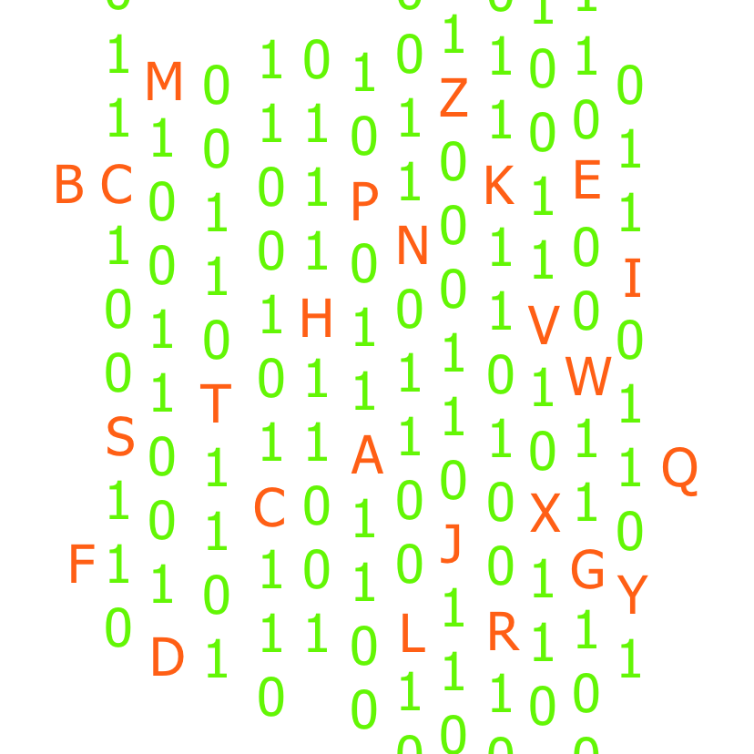
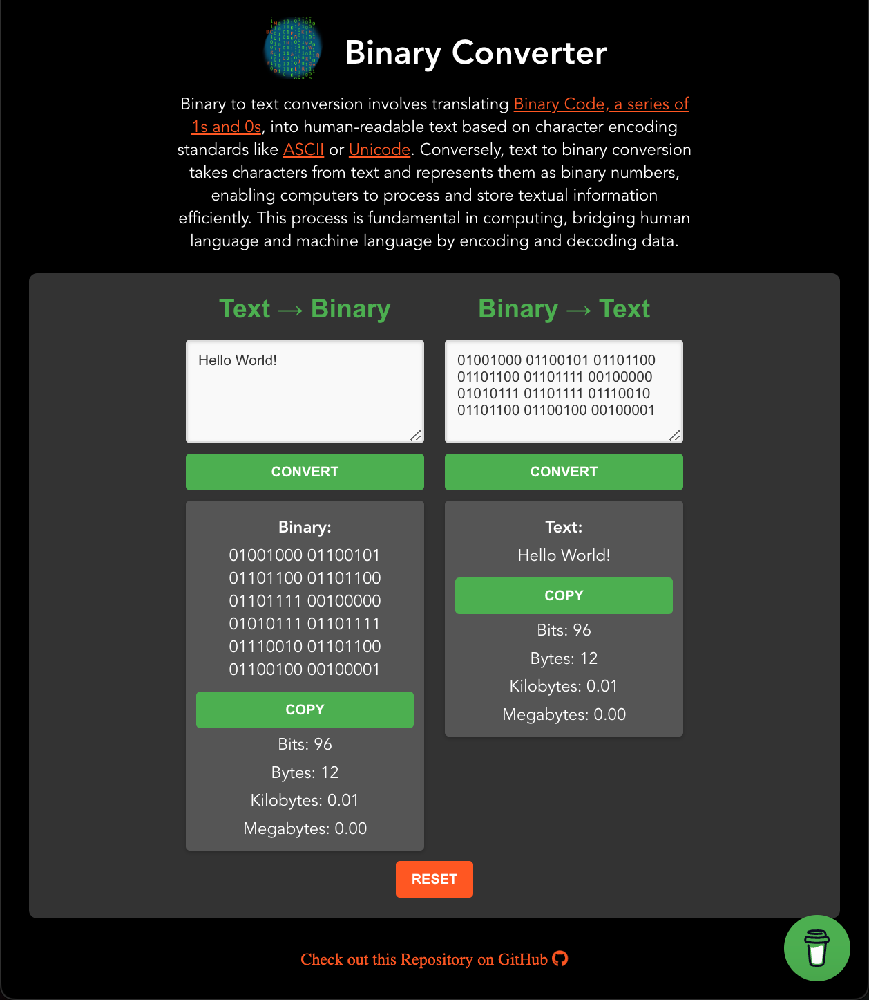

<!-- Begin README -->

<div align="center">
    <a href="https://scottgriv.github.io/vue-binary_converter/" target="_blank">
        
    </a>
</div>
<br>
<p align="center">
    <a href="https://vuejs.org/"></a>
    <a href="https://www.javascript.com/"></a>
    <a href="https://nodejs.org/en/"></a>
    <a href="http://lesscss.org/"></a>
    <br>
    <a href="https://github.com/scottgriv"></a>
    <a href="mailto:scott.grivner@gmail.com"></a>
    <a href="https://www.buymeacoffee.com/scottgriv"></a>
    <br>
    <a href="https://prgoptimized.com" target="_blank"></a>
</p>

---------------

<h1 align="center">𝟙𝟘 Binary Converter 𝟘𝟙</h1>

Convert text to binary (and vice versa) with this simple web application.
- Built using **Vue.js** and styled with **Less**.
- View a demo of the project on GitHub Pages **[Here](https://scottgriv.github.io/vue-binary_converter/)**.

<div align="center">
    <a href="https://scottgriv.github.io/vue-binary_converter/" target="_blank">
        
    </a>
    <br>
    <i>Application Preview</i>
</div>

---------------

## Table of Contents

- [Getting Started](#getting-started)
- [Resources](#resources)
- [License](#license)
- [Credits](#credits)

## Getting Started

1. Project setup
```
npm install
```

2. Compiles and hot-reloads for development
```
npm run serve
```

3. Compiles and minifies for production
```
npm run build
```

4. Lints and fixes files
```
npm run lint
```

## Resources

- [Vue.js](https://vuejs.org/) - A progressive, incrementally-adoptable JavaScript framework for building UI on the web.
- [Configuration Reference](https://cli.vuejs.org/config/) - Vue CLI configuration reference.
- [JavaScript](https://www.javascript.com/) - A lightweight, interpreted, or just-in-time compiled programming language with first-class functions.
- [Node.js](https://nodejs.org/en/) - A JavaScript runtime built on Chrome's V8 JavaScript engine.
- [Less](http://lesscss.org/) - A dynamic preprocessor style sheet language that can be compiled into Cascading Style Sheets (CSS) and run on the client-side or server-side.
- [Binary Number System](https://www.mathsisfun.com/binary-number-system.html) - A way of writing numbers using only two digits: 0 and 1 (the stuff computers use).

## License

This project is released under the terms of the **MIT License**, which permits use, modification, and distribution of the code, subject to the conditions outlined in the license.
- The [MIT License](https://choosealicense.com/licenses/mit/) provides certain freedoms while preserving rights of attribution to the original creators.
- For more details, see the [LICENSE](LICENSE) file in this repository. in this repository.

## Credits

**Author:** [Scott Grivner](https://github.com/scottgriv) <br>
**Email:** [scott.grivner@gmail.com](mailto:scott.grivner@gmail.com) <br>
**Website:** [scottgrivner.dev](https://www.scottgrivner.dev) <br>
**Reference:** [Main Branch](https://github.com/scottgriv/vue-binary_converter) <br>

---------------

<div align="center">
    <a href="https://github.com/scottgriv" target="_blank">
        
    </a>
</div>

<!-- End README -->
